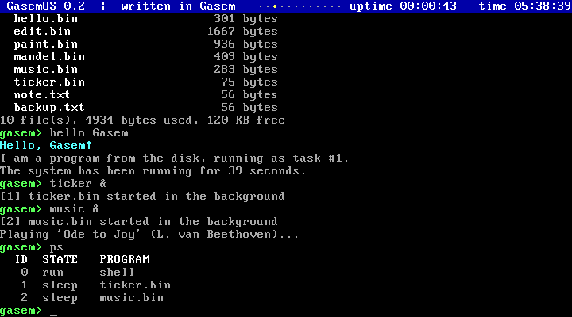
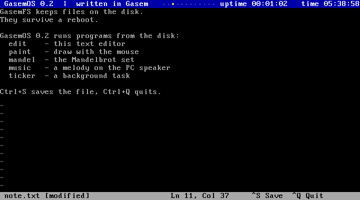
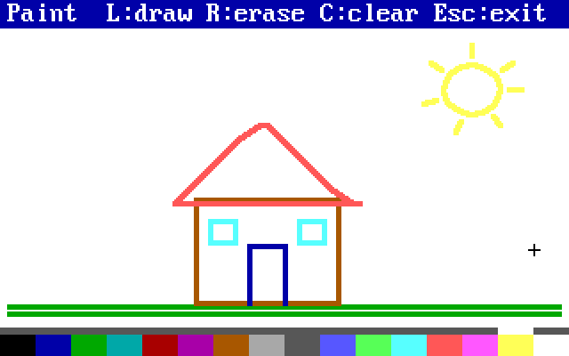
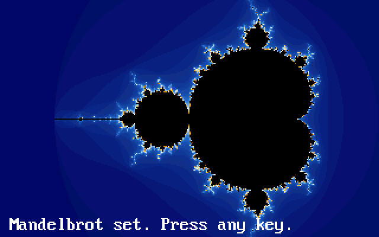

# GasemOS

Маленькая 32-битная операционная система, целиком написанная на языке **Gasem**
и собранная компилятором `gasem`. Загружается с диска в QEMU (и на реальном
x86-компьютере с BIOS), работает в защищённом режиме со страничной памятью,
выполняет несколько программ одновременно, запускает программы с диска и хранит
файлы в собственной файловой системе **GasemFS**.



## Сборка и запуск

```sh
gasem build os/gasemos.gsm -o gasemos.img        # или python3 -m gasem ...
qemu-system-i386 -drive format=raw,file=gasemos.img
```

или одной командой: `gasem run os/gasemos.gsm`. Образ — 163 КБ: загрузчик, ядро
и диск GasemFS на 128 КБ, на котором уже лежат программы. Их исходники — в
[`apps/`](apps/); компилятор собирает каждую отдельно прямо во время сборки
образа (директива `incprog`), так что нужна одна команда.

Звук PC-динамика в QEMU: `-audiodev pa,id=snd -machine pcspk-audiodev=snd`
(вместо `pa` — `alsa`, `sdl`, `coreaudio` или `dsound`, смотря по системе).

Изменения, сделанные в системе, записываются прямо в `gasemos.img` и
сохраняются между запусками.

Автоматический прогон в QEMU без окна со скриншотами (набирает команды,
работает с файлами, перезагружается, играет в «Змейку», запускает программы,
редактирует файл, рисует мышью):

```sh
python3 os/qemu_demo.py            # скриншоты → os/screenshots/
```

## Что умеет

- **Многозадачность**: до 7 программ одновременно с оболочкой. Таймер 100 раз в
  секунду переключает задачи по кругу; задача, которая ждёт клавишу или спит,
  процессор не занимает (тогда работает задача простоя с `hlt`).
- **Страничная память** (страницы по 4 МБ): у каждой программы свои 4 МБ с адреса
  `0x400000`, поэтому все программы собираются с одним `og` и не мешают друг другу.
- **Программы с диска**: файл `имя.bin` запускается по имени — `edit note.txt`,
  `paint`; `&` в конце — в фоне. `ps` показывает задачи, `kill` останавливает,
  Ctrl+C завершает программу, которую ждёт оболочка.
- **Системные вызовы** `int 0x80`: текст, клавиатура, время и сон, файлы, графика,
  мышь, звук (список — в [`abi.gsm`](abi.gsm)).
- **Защита от падений**: исключение в программе (деление на ноль, неизвестная
  команда …) завершает только её — с сообщением, где это случилось; система
  работает дальше. В ядре — экран «KERNEL PANIC».
- **Графика VGA 320×200, 256 цветов** без BIOS — регистры VGA программируются
  напрямую. Шрифт, палитра и текст на экране запоминаются и восстанавливаются,
  когда программа возвращается в текст (или завершается — даже аварийно).
- **Мышь PS/2** (IRQ 12), **звук через PC-динамик** (канал 2 таймера).
- **Клавиатура PS/2**: Shift, Ctrl, Caps Lock, стрелки, Home, End, PgUp, PgDn, Delete.
- **Загрузчик** (512 байт), **консоль VGA 80×25** со строкой состояния (время
  работы и часы CMOS), **драйвер диска ATA**, **файловая система GasemFS**
  (64 файла до 32 КБ, блоки по 512 байт).

## Программы на диске

| Программа          | Что делает                                                          |
|--------------------|---------------------------------------------------------------------|
| `hello [имя]`      | первая программа: приветствие, аргументы, номер задачи              |
| `edit <файл>`      | текстовый редактор: стрелки, Home/End, PgUp/PgDn, Delete, Tab; Ctrl+S — сохранить, Ctrl+Q или Esc — выйти (без сохранения переспросит) |
| `paint`            | рисование мышью: левая кнопка — рисовать, правая — стирать, палитра внизу, C — очистить, Esc — выход |
| `mandel`           | множество Мандельброта (числа с фиксированной точкой)               |
| `music`            | «Ода к радости» на PC-динамике; `music &` — играет в фоне           |
| `ticker &`         | фоновая задача: бегущая точка в строке состояния                    |

| | |
|---|---|
|  |  |
|  |  |

## Своя программа

```
include "../sdk.gsm"           ; путь к os/sdk.gsm от вашего файла

main:                          ; сюда передаётся управление, esi — аргументы
    print "Press a key: "
    getkey                     ; → eax: нажатая клавиша
    putc eax
    print "\nBye!\n"
    ret                        ; ret из main завершает программу

pool
```

```sh
gasem build prog.gsm -o prog.bin
python3 os/gasemfs.py gasemos.img put prog.bin     # положить на диск
```

и в GasemOS: `prog`. Чтобы программа попадала на диск при каждой сборке
системы, положите её в `os/apps/` и добавьте в [`fs_image.gsm`](fs_image.gsm)
(три строки: `chain`, `entry` и `incprog`).

[`sdk.gsm`](sdk.gsm) — это заголовок программы (`og`, сигнатура `GAPP`, адрес
`main`) и макросы-обёртки системных вызовов:

| Макрос                                   | Что делает                                    |
|------------------------------------------|-----------------------------------------------|
| `print "текст"`, `putc 'A'`, `printn eax` | вывод текста, символа, числа                 |
| `cls`, `locate строка - столбец`, `color 0x0E`, `cursor 0` | экран                      |
| `getkey`, `pollkey`                      | клавиша (ждать / не ждать) → `eax`; коды стрелок и т. п. — `KEY_UP` … |
| `ticks`, `sleep 50`, `random`, `taskid`, `yield` | время (тики по 10 мс), случайные числа, задачи |
| `readfile имя - буфер - размер`, `writefile имя - данные - размер` | файлы             |
| `graphics`, `textmode`                   | графика 320×200 / снова текст                 |
| `pixel x - y - цвет`, `rect x - y - ш - в - цвет`, `gtext x - y - цвет - "текст"`, `palette n - 0xRRGGBB` | рисование; видеопамять — `GFX` (байт на точку) |
| `mouse`                                  | `eax` — x, `ebx` — y, `ecx` — кнопки         |
| `sound 440`, `nosound`                   | звук                                          |
| `exit`                                   | завершить программу                           |

Программа может писать прямо в видеопамять (`TEXT_VGA`, `GFX`) — так быстрее.
Память после самой программы (с `HEAP`, 3 МБ) заполнена нулями.

## Команды оболочки

| Команда                 | Что делает                                         |
|-------------------------|----------------------------------------------------|
| `help`                  | список команд                                      |
| `<программа> [аргументы] [&]` | запустить `программа.bin` (с `&` — в фоне)   |
| `run <файл> [аргументы] [&]` | то же для файла с любым именем                |
| `ps`                    | список задач: номер, состояние, программа          |
| `kill <номер>`          | остановить задачу                                  |
| `beep [Гц] [мс]`        | звук (по умолчанию 880 Гц, 200 мс)                 |
| `clear`, `about`, `echo <текст>`, `color <1-15>` | экран и текст             |
| `calc 6*7`              | калькулятор: `+ - * / %`, отрицательные результаты |
| `time`, `uptime`, `mem`, `cpu` | часы, время работы, память, процессор (CPUID) |
| `snake`                 | игра «Змейка» (стрелки или WASD, Q — выход)        |
| `crash`                 | деление на ноль в ядре — проверка экрана паники    |
| `reboot`, `shutdown`    | перезагрузка, выключение (ACPI, работает в QEMU)   |
| `ls`, `cat <файл>`      | список файлов, показать файл                       |
| `write <файл> <текст>`, `append <файл> <текст>` | создать файл, дописать строку |
| `cp <откуда> <куда>`, `mv <старое> <новое>`, `rm <файл>` | копировать, переименовать, удалить |
| `format`                | стереть диск и создать пустую GasemFS              |

Тексты в самой системе — на английском: стандартный шрифт VGA не содержит
кириллицы.

## Скриншоты (QEMU)

| | |
|---|---|
|  |  |
|  |  |
|  |  |
|  | |

На скриншоте 6 — новая загрузка с того же диска: файлы, созданные перед
выключением, на месте.

## Устройство

| Файл              | Содержимое                                                     |
|-------------------|----------------------------------------------------------------|
| `gasemos.gsm`     | главный файл: `og 0x7C00`, карта памяти, подключение модулей    |
| `abi.gsm`         | общее с программами: адреса, коды клавиш, номера системных вызовов |
| `boot.gsm`        | загрузчик (сектор 0)                                           |
| `kernel.gsm`      | точка входа ядра, инициализация, логотип                       |
| `tasks.gsm`       | задачи, переключение, страничная память, запуск программ       |
| `syscalls.gsm`    | системные вызовы `int 0x80`                                    |
| `programs.gsm`    | команды `run`, `ps`, `kill`, `beep`                            |
| `console.gsm`     | вывод на экран, числа, строка состояния, CMOS                  |
| `interrupts.gsm`  | IDT, PIC, PIT, таймер, исключения и падения программ           |
| `keyboard.gsm`    | клавиатура                                                     |
| `mouse.gsm`       | мышь                                                           |
| `vga.gsm`         | графика 320×200: регистры VGA, шрифт, палитра, рисование       |
| `sound.gsm`       | PC-динамик                                                     |
| `ata.gsm`         | драйвер диска                                                  |
| `fs.gsm`          | файловая система GasemFS                                       |
| `shell.gsm`, `files.gsm` | оболочка, файловые команды                              |
| `snake.gsm`       | игра «Змейка»                                                  |
| `fs_image.gsm`    | начальное содержимое диска; программы собираются через `incprog` |
| `sdk.gsm`         | заголовок и макросы для программ                               |
| `apps/*.gsm`      | программы: hello, edit, paint, mandel, music, ticker           |
| `qemu_demo.py`    | запуск в QEMU, набор команд, мышь, скриншоты                   |
| `gasemfs.py`      | работа с GasemFS в образе диска с компьютера                   |

Карта памяти (физические адреса):

| Адрес                 | Что там                                               |
|-----------------------|-------------------------------------------------------|
| `0x1000`              | таблица прерываний (IDT)                              |
| `0x7C00`              | загрузчик, за ним (`0x7E00`) — ядро                   |
| `0x10000`–`0x17FFF`   | каталоги страниц задач (по 4 КБ)                      |
| `0x18000`–`0x18FFF`   | стек задачи простоя                                   |
| `0x20000`             | тело змейки                                           |
| `0x30000`, `0x31000`  | таблица блоков и каталог GasemFS, буфер сектора       |
| `0x40000`             | буфер файла (32 КБ)                                   |
| `0x48000`–`0x4B2FF`   | шрифт, текстовый экран и палитра на время графики     |
| `0x50000`–`0x8FFFF`   | стеки задач (по 32 КБ, задача 0 — сверху)             |
| `0xA0000`, `0xB8000`  | видеопамять: графика и текст                          |
| `0x800000` + 4 МБ·(n−1) | память программы в задаче n — видна ей по адресу `0x400000` |

Каталог страниц каждой задачи отображает всю память как есть, кроме окна
`0x400000`–`0x7FFFFF`. Ядро, видеопамять и буферы доступны программам по тем же
адресам; программы работают в кольце 0 (как и ядро) — это учебная система.

Задача — структура `Task` (`struct` в [`tasks.gsm`](tasks.gsm)): состояние,
сохранённый `esp`, каталог страниц, тик пробуждения, имя и аргументы. Новая
задача получает стек, на котором лежит «кадр прерывания» — будто таймер прервал
её на первой команде `main`, а под ним — адрес `task_exit`, поэтому `ret` из
`main` завершает программу.

## GasemFS

Расположение на диске (секторы по 512 байт):

| Сектор         | Содержимое                                                     |
|----------------|----------------------------------------------------------------|
| 0              | загрузчик                                                      |
| 1 – …          | ядро                                                           |
| 64             | суперблок: сигнатура `GASEMFS1`, число блоков и записей         |
| 65             | таблица блоков: 256 записей по 2 байта — `0` свободен, `0xFFFF` последний блок файла, иначе номер следующего блока |
| 66 – 69        | каталог: 64 записи по 32 байта — имя (до 23 символов), размер, первый блок |
| 70 – 325       | 256 блоков данных по 512 байт (блок 0 не используется)          |

С файловой системой можно работать и с компьютера, не запуская ОС:

```sh
python3 os/gasemfs.py gasemos.img ls             # список файлов
python3 os/gasemfs.py gasemos.img cat note.txt   # показать файл
python3 os/gasemfs.py gasemos.img put my.bin     # положить свой файл на диск
python3 os/gasemfs.py gasemos.img check          # проверить целостность
```

## Возможности Gasem, которые здесь используются

- `macro` — обёртки системных вызовов в SDK, ноты в `music`, таблица блоков и
  каталог в `fs_image.gsm`;
- `proc` с `local`, `uses` и `return` — редактор, рисование (отрезок по
  Брезенхему на локальных переменных), Мандельброт;
- `struct` — таблица задач (`Task.esp`, `Task.size`, `&& MAX_TASKS+1 Task`);
- `incprog` — каждая программа собирается отдельно, но вместе с образом;
- `if`/`while`/`for`/`repeat`, `let` (в том числе `let signed` с `>>` в
  Мандельброте), строки в вызовах и `args`, `ret if carry`, `push`/`pop` списком,
  `do` со строками, `&&` со ссылками вперёд, `pool`, `include`, локальные метки.

Каждая версия проверяется тестами в QEMU (`tests/test_os.py`): команды
оболочки, файлы после перезагрузки, программы и фоновые задачи, Ctrl+C,
падение программы, редактор, рисование мышью и Мандельброт (видеопамять
читается из QEMU), звук (запись PC-динамика в WAV и проверка частоты).
Образ, собранный Go- и Python-версиями компилятора, совпадает байт в байт.
