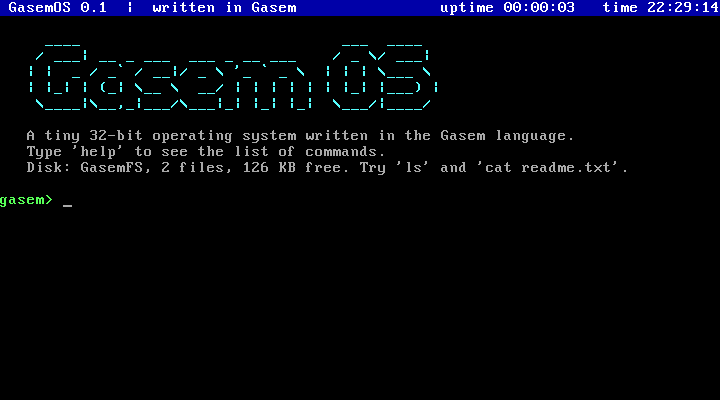
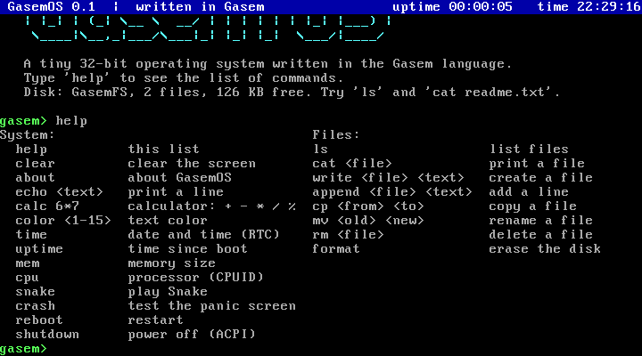
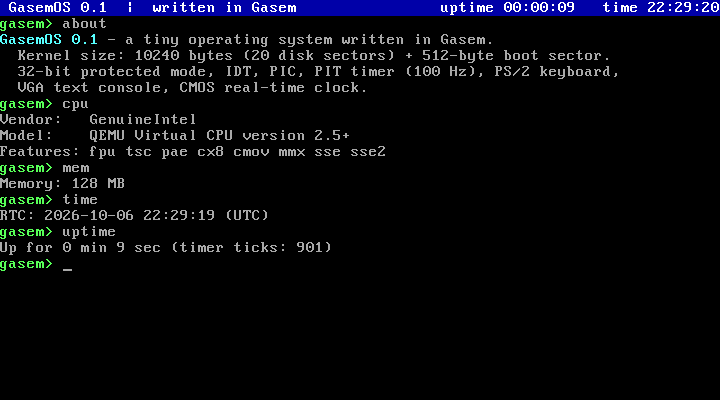
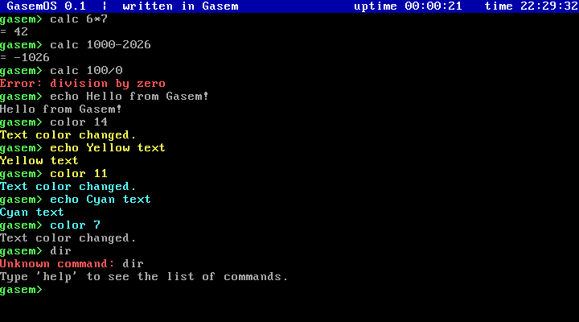
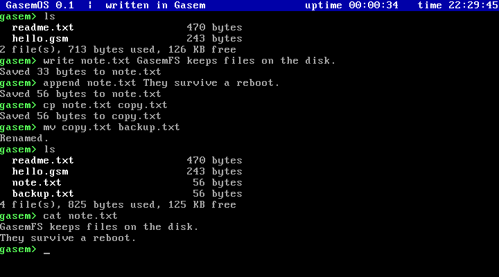
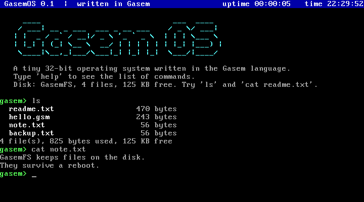
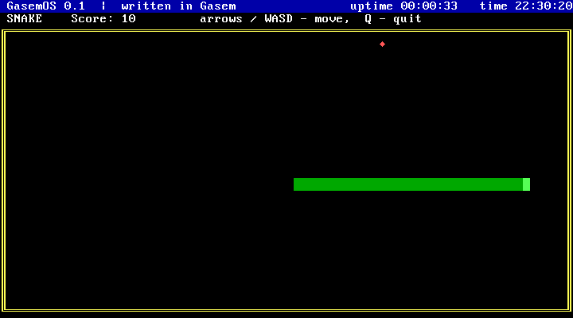
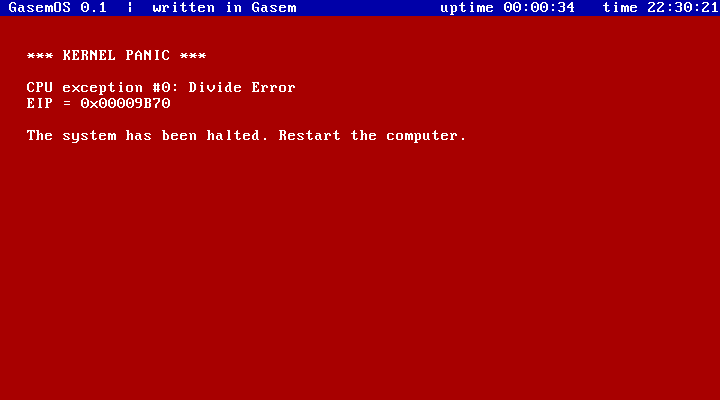

# GasemOS

Маленькая 32-битная операционная система, целиком написанная на языке **Gasem**
и собранная компилятором `gasem`. Загружается с диска в QEMU (и на реальном
x86-компьютере с BIOS), работает в защищённом режиме, принимает команды с
клавиатуры и хранит файлы на диске в собственной файловой системе **GasemFS**.



## Сборка и запуск

```sh
python3 -m gasem os/gasemos.gsm -o gasemos.img
qemu-system-i386 -drive format=raw,file=gasemos.img
```

Образ диска — 163 КБ: загрузчик, ядро и файловая система GasemFS на 128 КБ.
Изменения, сделанные в системе, записываются прямо в `gasemos.img` и
сохраняются между запусками.

Автоматический прогон в QEMU без окна со скриншотами (набирает команды,
работает с файлами, выключает и снова загружает систему, играет в «Змейку»,
вызывает исключение):

```sh
python3 os/qemu_demo.py            # скриншоты → os/screenshots/
```

## Что умеет

- **Загрузчик** (`boot.gsm`, 512 байт): читает ядро с диска через BIOS (int 13h,
  LBA), включает A20 (`mov a20 - 1`), загружает GDT, переходит в 32-битный
  защищённый режим.
- **Консоль VGA 80×25**: вывод с прокруткой, цвета, табуляция, аппаратный курсор.
- **Строка состояния**: время с момента загрузки и часы реального времени (CMOS),
  обновляется по прерыванию таймера раз в секунду.
- **Прерывания**: IDT на 256 векторов, контроллер PIC перенастроен на 0x20–0x2F,
  таймер PIT на 100 Гц.
- **Исключения процессора**: экран «KERNEL PANIC» с номером, названием, адресом
  команды (EIP) и кодом ошибки.
- **Клавиатура PS/2**: Shift, Caps Lock, стрелки, кольцевой буфер нажатий.
- **Драйвер диска ATA** (`ata.gsm`): чтение и запись секторов через порты
  0x1F0–0x1F7 — в защищённом режиме BIOS уже недоступен.
- **Файловая система GasemFS** (`fs.gsm`): каталог на 64 файла, файлы любого
  размера до 32 КБ из цепочек блоков по 512 байт, файлы сохраняются на диске.
- **Оболочка** с редактированием строки (Backspace) и командами:

| Команда                 | Что делает                                         |
|-------------------------|----------------------------------------------------|
| `help`                  | список команд                                      |
| `clear`                 | очистить экран                                     |
| `about`                 | о системе (размер ядра и т. п.)                    |
| `echo <текст>`          | напечатать текст                                   |
| `calc 6*7`              | калькулятор: `+ - * / %`, отрицательные результаты |
| `color <1-15>`          | цвет текста                                        |
| `time`                  | дата и время из часов реального времени            |
| `uptime`                | время работы                                       |
| `mem`                   | объём памяти                                       |
| `cpu`                   | процессор: производитель, модель, возможности (CPUID) |
| `snake`                 | игра «Змейка» (стрелки или WASD, Q — выход)        |
| `crash`                 | деление на ноль — проверка обработчика исключений  |
| `reboot`                | перезагрузка                                       |
| `shutdown`              | выключение (ACPI, работает в QEMU)                 |
| `ls`                    | список файлов, занятое и свободное место           |
| `cat <файл>`            | показать файл                                      |
| `write <файл> <текст>`  | создать файл (или перезаписать)                    |
| `append <файл> <текст>` | дописать строку в конец файла                      |
| `cp <откуда> <куда>`    | скопировать файл                                   |
| `mv <старое> <новое>`   | переименовать файл                                 |
| `rm <файл>`             | удалить файл                                       |
| `format`                | стереть диск и создать пустую GasemFS              |

На диске уже лежат два файла: `readme.txt` и `hello.gsm` — загрузчик из
документации Gasem. Их кладёт туда сам компилятор при сборке образа
(`fs_image.gsm`).

Тексты в самой системе — на английском: стандартный шрифт VGA в текстовом
режиме не содержит кириллицы.

## Скриншоты (QEMU)

| | |
|---|---|
|  |  |
|  |  |
|  |  |
|  | |

На скриншоте 6 — новая загрузка с того же диска: файлы, созданные перед
выключением, на месте.

## GasemFS

Расположение на диске (секторы по 512 байт):

| Сектор         | Содержимое                                                     |
|----------------|----------------------------------------------------------------|
| 0              | загрузчик                                                      |
| 1 – …          | ядро                                                           |
| 64             | суперблок: сигнатура `GASEMFS1`, число блоков и записей         |
| 65             | таблица блоков: 256 записей по 2 байта — `0` свободен, `0xFFFF` последний блок файла, иначе номер следующего блока |
| 66 – 69        | каталог: 64 записи по 32 байта — имя (до 23 символов), размер, первый блок |
| 70 – 325       | 256 блоков данных по 512 байт (блок 0 не используется)          |

Таблица блоков и каталог читаются в память при загрузке и записываются на
диск после каждого изменения.

С файловой системой можно работать и с компьютера, не запуская ОС:

```sh
python3 os/gasemfs.py gasemos.img ls             # список файлов
python3 os/gasemfs.py gasemos.img cat note.txt   # показать файл
python3 os/gasemfs.py gasemos.img put my.txt     # положить свой файл на диск
python3 os/gasemfs.py gasemos.img check          # проверить целостность
```

## Устройство

| Файл              | Содержимое                                                     |
|-------------------|----------------------------------------------------------------|
| `gasemos.gsm`     | главный файл: `og 0x7C00`, карта памяти, подключение модулей    |
| `boot.gsm`        | загрузчик (сектор 0)                                           |
| `kernel.gsm`      | точка входа ядра, инициализация, логотип                       |
| `console.gsm`     | вывод на экран, числа, строка состояния, CMOS                  |
| `interrupts.gsm`  | IDT, PIC, PIT, обработчик таймера, исключения                  |
| `keyboard.gsm`    | драйвер клавиатуры                                             |
| `ata.gsm`         | драйвер диска                                                  |
| `fs.gsm`          | файловая система GasemFS                                       |
| `shell.gsm`       | оболочка и команды                                             |
| `files.gsm`       | файловые команды                                               |
| `snake.gsm`       | игра «Змейка»                                                  |
| `fs_image.gsm`    | начальное содержимое диска (собирается компилятором Gasem)     |
| `qemu_demo.py`    | запуск в QEMU, набор команд, скриншоты                         |
| `gasemfs.py`      | работа с GasemFS в образе диска с компьютера                   |

Карта памяти:

| Адрес              | Что там                       |
|--------------------|-------------------------------|
| `0x1000`–`0x17FF`  | таблица прерываний (IDT)      |
| `0x7C00`           | загрузчик                     |
| `0x7E00`–…         | ядро                          |
| `0x20000`          | тело змейки                   |
| `0x30000`          | таблица блоков и каталог GasemFS |
| `0x31000`          | буфер сектора                 |
| `0x40000`          | буфер файла (32 КБ)           |
| `0x90000`          | вершина стека                 |
| `0xB8000`          | видеопамять                   |

Всё собирается одним файлом: загрузчик кладёт ядро сразу за собой (0x7E00),
поэтому адреса продолжаются после единственного `og 0x7C00`. Число секторов
ядра загрузчик узнаёт из константы
`KERNEL_SECTORS = (kernel_end-kernel_start)/512`, которая ссылается вперёд,
в конец ядра. Если ядро вырастет и залезет на файловую систему, сборка
остановится с ошибкой.

Возможности Gasem, которые здесь используются: `if`/`elif`/`else`, `while`,
`for`, `repeat`/`until`, `break` и `let` (драйвер диска, файловая система,
консоль, клавиатура, оболочка), `mov a20 - 1`, `nxtb`, `chk`, `jf…`, `do` со
строками (заголовок строки состояния и `about`), `&& 32 call exc_common`
(32 заглушки исключений одной строкой), `b/ 128:` и `b/ 24:` (таблицы клавиатуры,
имена в каталоге), `&& 510-($-$$) b: 0`, `include`, локальные метки.
