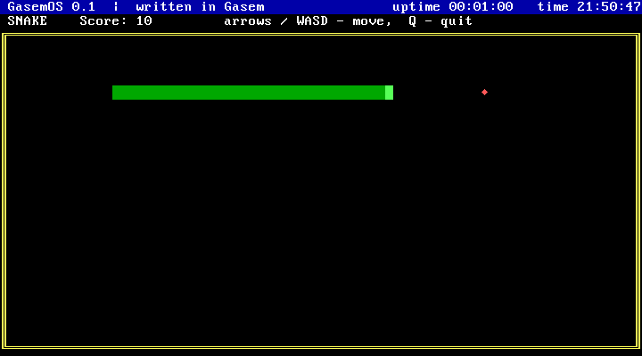
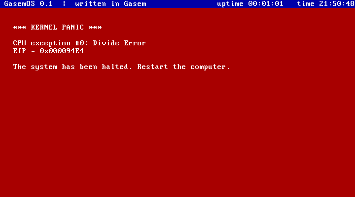

# GasemOS

Маленькая 32-битная операционная система, целиком написанная на языке **Gasem**
и собранная компилятором `gasem`. Загружается с диска в QEMU (и на реальном
x86-компьютере с BIOS), работает в защищённом режиме, принимает команды с
клавиатуры.


## Сборка и запуск

```sh
python3 -m gasem os/gasemos.gsm -o gasemos.img
qemu-system-i386 -drive format=raw,file=gasemos.img
```

Образ — около 7,5 КБ: загрузочный сектор (512 байт) и ядро (14 секторов).

Автоматический прогон в QEMU без окна со скриншотами (набирает команды,
играет в «Змейку», вызывает исключение):

```sh
python3 os/qemu_demo.py            # скриншоты → os/screenshots/
```

## Что умеет

- **Загрузчик** (`boot.gsm`, 512 байт): читает ядро с диска через BIOS (int 13h,
  LBA), включает A20 (`mov a20 - 1`), загружает GDT, переходит в 32-битный
  защищённый режим.
- **Консоль VGA 80×25**: вывод с прокруткой, цвета, аппаратный курсор.
- **Строка состояния**: время с момента загрузки и часы реального времени (CMOS),
  обновляется по прерыванию таймера раз в секунду.
- **Прерывания**: IDT на 256 векторов, контроллер PIC перенастроен на 0x20–0x2F,
  таймер PIT на 100 Гц.
- **Исключения процессора**: экран «KERNEL PANIC» с номером, названием, адресом
  команды (EIP) и кодом ошибки.
- **Клавиатура PS/2**: Shift, Caps Lock, стрелки, кольцевой буфер нажатий.
- **Оболочка** с редактированием строки (Backspace) и командами:

| Команда            | Что делает                                         |
|--------------------|----------------------------------------------------|
| `help`             | список команд                                      |
| `clear`            | очистить экран                                     |
| `about`            | о системе (размер ядра и т. п.)                    |
| `echo <текст>`     | напечатать текст                                   |
| `calc 6*7`         | калькулятор: `+ - * / %`, отрицательные результаты |
| `color <1-15>`     | цвет текста                                        |
| `time`             | дата и время из часов реального времени            |
| `uptime`           | время работы                                       |
| `mem`              | объём памяти                                       |
| `cpu`              | процессор: производитель, модель, возможности (CPUID) |
| `snake`            | игра «Змейка» (стрелки или WASD, Q — выход)        |
| `crash`            | деление на ноль — проверка обработчика исключений  |
| `reboot`           | перезагрузка                                       |
| `shutdown`         | выключение (ACPI, работает в QEMU)                 |

Тексты в самой системе — на английском: стандартный шрифт VGA в текстовом
режиме не содержит кириллицы.

## Скриншоты (QEMU)

| | |
|---|---|
|  |  |
|  |  |
|  | |

## Устройство

| Файл              | Содержимое                                                     |
|-------------------|----------------------------------------------------------------|
| `gasemos.gsm`     | главный файл: `og 0x7C00`, карта памяти, подключение модулей    |
| `boot.gsm`        | загрузчик (сектор 0)                                           |
| `kernel.gsm`      | точка входа ядра, инициализация, логотип                       |
| `console.gsm`     | вывод на экран, числа, строка состояния, CMOS                  |
| `interrupts.gsm`  | IDT, PIC, PIT, обработчик таймера, исключения                  |
| `keyboard.gsm`    | драйвер клавиатуры                                             |
| `shell.gsm`       | оболочка и команды                                             |
| `snake.gsm`       | игра «Змейка»                                                  |
| `qemu_demo.py`    | запуск в QEMU, набор команд, скриншоты                         |

Карта памяти:

| Адрес              | Что там                       |
|--------------------|-------------------------------|
| `0x1000`–`0x17FF`  | таблица прерываний (IDT)      |
| `0x7C00`           | загрузчик                     |
| `0x7E00`–…         | ядро                          |
| `0x20000`          | тело змейки                   |
| `0x90000`          | вершина стека                 |
| `0xB8000`          | видеопамять                   |

Всё собирается одним файлом: загрузчик кладёт ядро сразу за собой (0x7E00),
поэтому адреса продолжаются после единственного `og 0x7C00`. Число секторов
ядра загрузчик узнаёт из константы
`KERNEL_SECTORS = (kernel_end-kernel_start)/512`, которая ссылается вперёд,
в конец ядра.

Возможности Gasem, которые здесь используются: `mov a20 - 1`, `nxtb`, `chk`,
`jf…`, `do` со строками (заголовок строки состояния и `about` собираются при
компиляции), `&& 32 call exc_common` (32 заглушки исключений одной строкой),
`b/ 128:` (таблицы клавиатуры), `&& 510-($-$$) b: 0`, `include`, локальные метки.
